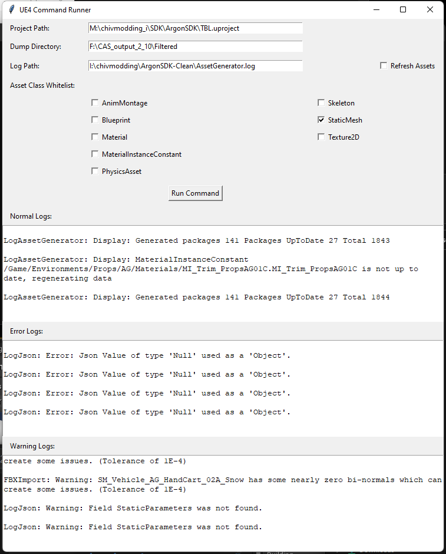
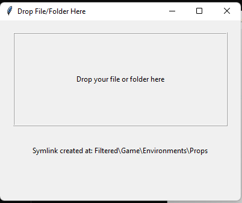

## (WIP) TKinter GUI for executing AssetGenerator commandlet

small gui for running assetgenerator

requirements: tkinter, tkinterdnd2

## Usage
1. set your project + (filtered) dir path in assetgen_runner.py
2. if UE editor isnt in path, adjust the path to `UE4Editor-Cmd.exe`

### If you want to work with a small subset of the CAS generated data

1. place symlink_filter.py in the same folder as CAS output (next to "Game")
2. run symlink_filter and drag and drop folders from Game dir that you want to process
it will create a subdir named "Filtered" and create needed structure + symlinks

